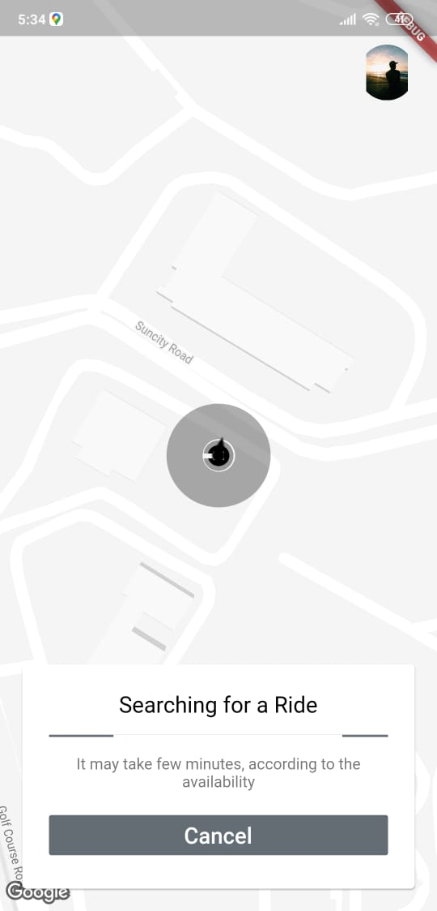
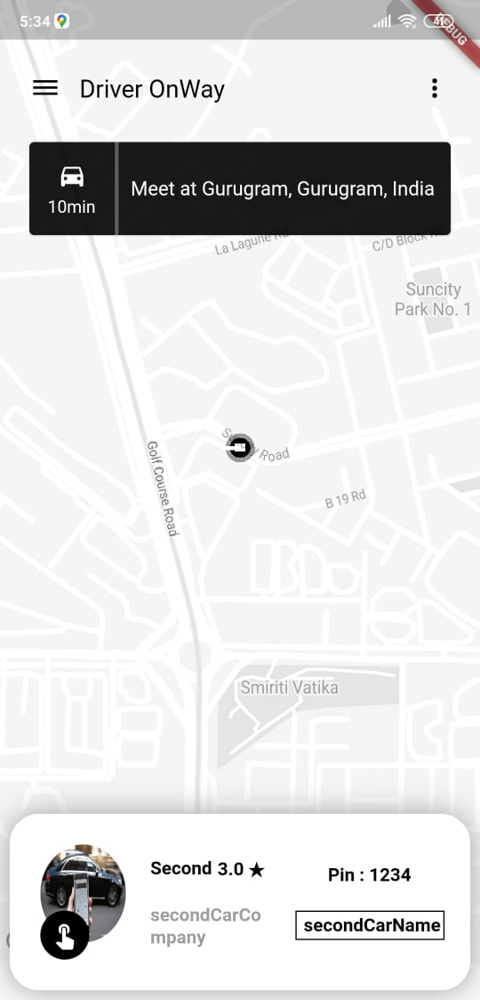
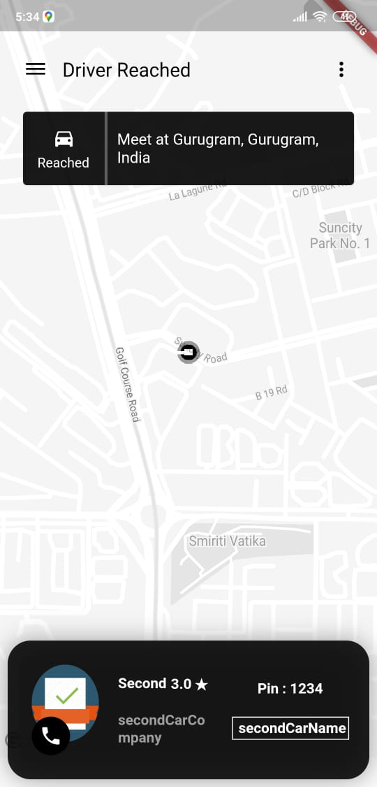
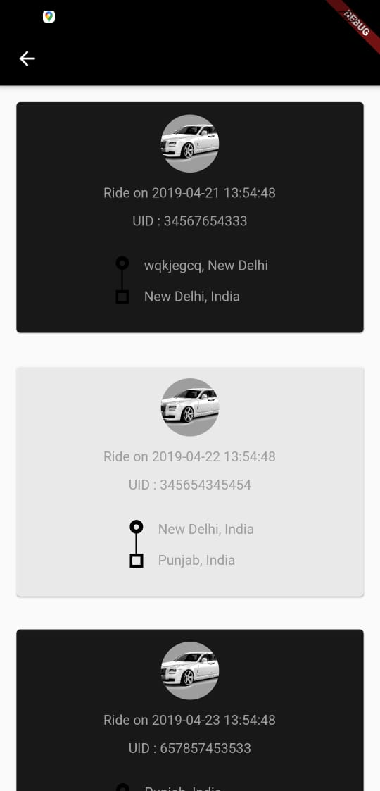
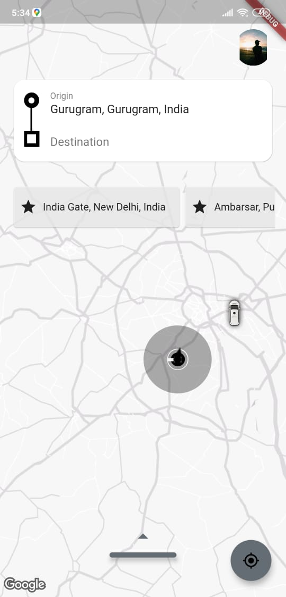

# Fuber - Taxi booking App UI!

Hi! This is the clone to the App based Taxi booking Services like Uber using  Flutter and [Provider](https://github.com/rrousselGit/provider) as a state management in it. Its unstable and i wont be maintaining it. You can find some usefull methods inside it, some of them are used as answeres on [stackoverflow](https://stackoverflow.com/search?tab=newest&q=user:7910735%20%5Bflutter%5D) by me, releated to maps in flutter.
You can also learn about maintaining the Complex UI on single screen and animations and there visibility using Provider.


### Some Known issues and there solutions.
If you are running it, you will find some silly and annoying bugs.
* You have to provide permission before running the application.
* If you are providing permission on runtime, you have to restart the application (my poor ability to maintain statessssss)
* Same goes for initializing the location service. You have to restart the application if location service is initiated on runtime.

## ScreenShots

<p align="center">

</p>

### Features
Some of the listed features implemented are :
* Automatic Zoom IN/Out on certain actions.
* Polyline Generation from current position to provided location.
* Places search form the destination TextField. (drop down list to show 5 places related to the search keywords).
* Payment Selector from different method.
* Cab selection and cost estimator (dummy).
* Custom map style, like Uber.

Every data provided like cabs, cost etc are dummy but configured to easily apply the Api's with minor changes to it. Please add your api key's to Constant files and Manifest file.

## License
```
Copyright [2020] [Sahdeep Singh]

Licensed under the Apache License, Version 2.0 (the "License");
you may not use this file except in compliance with the License.
You may obtain a copy of the License at

   http://www.apache.org/licenses/LICENSE-2.0

Unless required by applicable law or agreed to in writing, software
distributed under the License is distributed on an "AS IS" BASIS,
WITHOUT WARRANTIES OR CONDITIONS OF ANY KIND, either express or implied.
See the License for the specific language governing permissions and
limitations under the License.
```

## Author & support
This project is created by [Sahdeep Singh](https://github.com/iamSahdeep) but with lots of support and help.

Made with 
